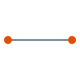
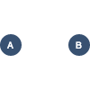
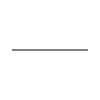

# Problem Graph Visualisation

[](https://travis-ci.org/marcbreitung/problem-graph-visualisation) [](https://coveralls.io/github/marcbreitung/problem-graph-visualisation?branch=master)

Draws the [problem-map-generator](https://github.com/marcbreitung/problem-map-generator) graph in a canvas.

```html
<canvas id="search-map" width="100" height="100"></canvas>

<script src="dist/problem-graph-visualisation.min.js"></script>
<script>
    let canvas = new ProblemGraphVisualisation.Canvas({
        element: document.getElementById('search-map'),
        height: 100,
        width: 100
    });
    canvas.rendererFabric.registerRenderer('node', ProblemGraphVisualisation.NodesRenderer);
    
    let level = new ProblemGraphVisualisation.Level('level 01', {
        type: 'node',
        nodes: [
            {label: 'A', position: {x: 10, y: 50}, childs: [{position: {x: 90, y: 50}, childs: []}]},
            {label: 'B', position: {x: 90, y: 50}, childs: [{position: {x: 10, y: 50}, childs: []}]}
        ], 
        nodeColor: '#e34f00', 
        lineColor: '#385171'
    });
    canvas.addLevel(level);
    canvas.update();
</script>
```
## Canvas Object
```javascript
  let canvas = new ProblemGraphVisualisation.Canvas(attributes);
```
### Possible Attributes
| Attribute | Type | Default Value | Description |
| --- | --- | --- | --- |
| `element` | Element | `null` | canvas DOM element |
| `height` | integer | `100` | canvas height |
| `width` | integer | `100` | canvas width |
| `background` | string | `#FFFFFF` | background color as Hex |

## Level Object
```javascript
let level = new ProblemGraphVisualisation.Level(name, attributes)
```
### Possible Attributes
| Attribute | Type | Default Value | Description |
| --- | --- | --- | --- |
| `type` | string | `null` | defines the renderer `node` or `text` |
| `nodes` | array | `[]` | list of nodes |
| `nodeColor` | string | `#000000` | node color as Hex |
| `lineColor` | string | `#000000` | line color as Hex |
| `textColor` | string | `#FFFFFF` | text color as Hex |
| `nodeSize` | integer | 10 | node size |
| `textSize` | integer | 12 | text size |
| `lineSize` | integer | 1 | line size |

## Node Renderer
```javascript
let canvas = new ProblemGraphVisualisation.Canvas({});
canvas.rendererFabric.registerRenderer('node', ProblemGraphVisualisation.NodesRenderer);
```
### Output


## Text Renderer
```javascript
let canvas = new ProblemGraphVisualisation.Canvas({});
canvas.rendererFabric.registerRenderer('text', ProblemGraphVisualisation.TextRenderer);
```
### Output



## Result Renderer
```javascript
let canvas = new ProblemGraphVisualisation.Canvas({});
canvas.rendererFabric.registerRenderer('result', ProblemGraphVisualisation.ResultRenderer);
```
### Output
